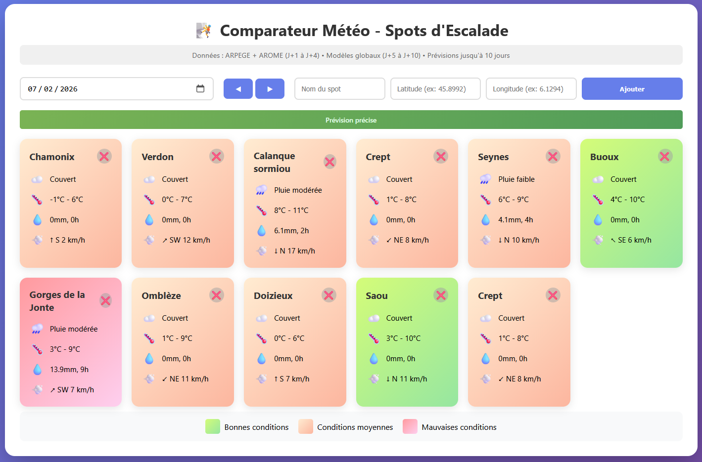

# Comparateur meteo de sites d'escalade

L'idée de cette app est de pouvoir comparer rapidement la météo de plusieurs lieux à une date donnée.
Un peu dans le style de climbit ou rock climbing weather, mais la liste de spot est gérée par chaque utilisateur.

Cet outil permet d'ajouter des points gps avec un label, et de les afficher avec un code couleur selon la qualité des conditions météos pour une journée escalade.

